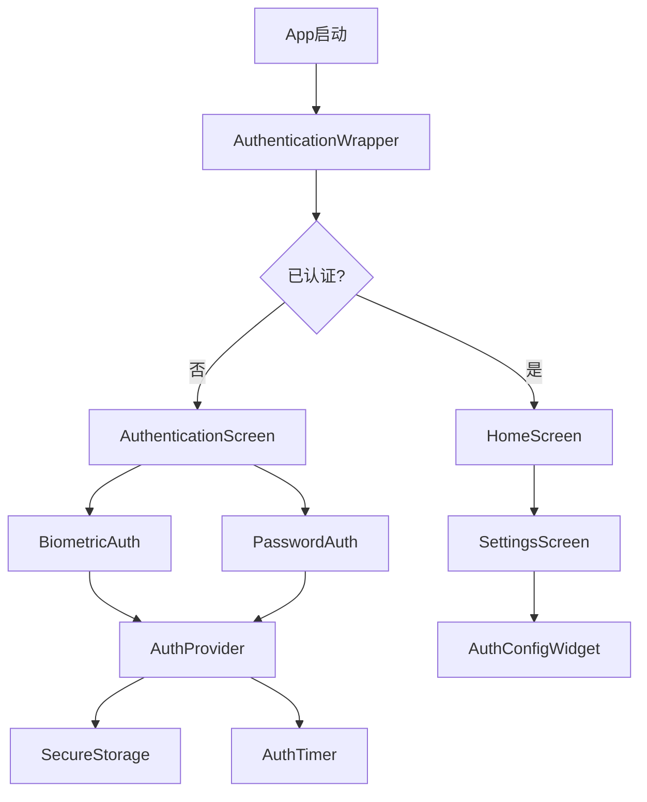
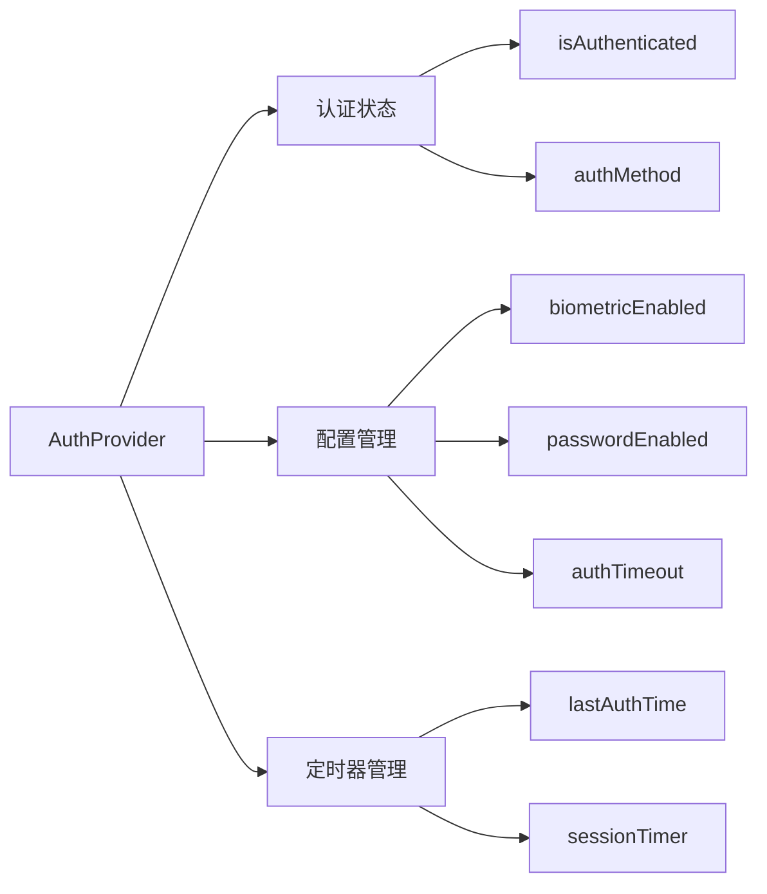

# Design Document

## Overview

本设计文档描述了为MyKeyVault TOTP应用添加生物识别认证功能的技术实现方案。该功能将集成local_auth插件，提供指纹和密码两种认证方式，并包含完整的配置管理系统。

设计遵循当前项目的Provider状态管理模式，使用SharedPreferences进行本地数据持久化，并保持与现有Material Design 3主题系统的一致性。

## Architecture

### 核心组件架构



### 状态管理架构



## Components and Interfaces

### 1. AuthProvider (状态管理)

```dart
class AuthProvider extends ChangeNotifier {
  // 认证状态
  bool _isAuthenticated = false;
  AuthMethod? _currentAuthMethod;
  DateTime? _lastAuthTime;
  Timer? _sessionTimer;
  
  // 配置状态
  bool _biometricEnabled = false;
  bool _passwordEnabled = false;
  int _authTimeoutMinutes = 15;
  ThemeMode _themeMode = ThemeMode.system;
  
  // 生物识别相关
  final LocalAuthentication _localAuth = LocalAuthentication();
  bool _biometricAvailable = false;
  List<BiometricType> _availableBiometrics = [];
  
  // 密码相关
  String? _hashedPassword;
  int _failedAttempts = 0;
  DateTime? _lockoutEndTime;
}
```

### 2. AuthenticationWrapper (认证包装器)

```dart
class AuthenticationWrapper extends StatefulWidget {
  final Widget child;
  
  const AuthenticationWrapper({Key? key, required this.child}) : super(key: key);
}
```

负责在应用启动时检查认证状态，决定显示认证界面还是主界面。

### 3. AuthenticationScreen (认证界面)

```dart
class AuthenticationScreen extends StatefulWidget {
  const AuthenticationScreen({Key? key}) : super(key: key);
}
```

主要认证界面，包含：
- 生物识别认证组件
- 密码认证组件
- 认证方式切换
- 错误处理和反馈

### 4. BiometricAuthWidget (生物识别组件)

```dart
class BiometricAuthWidget extends StatelessWidget {
  final VoidCallback? onSuccess;
  final VoidCallback? onError;
  final VoidCallback? onSwitchToPassword;
}
```

### 5. PasswordAuthWidget (密码认证组件)

```dart
class PasswordAuthWidget extends StatelessWidget {
  final VoidCallback? onSuccess;
  final VoidCallback? onError;
  final VoidCallback? onSwitchToBiometric;
}
```

### 6. SettingsScreen (设置界面)

扩展现有设置功能，添加认证相关配置：

```dart
class SettingsScreen extends StatelessWidget {
  // 现有设置 + 新增认证设置
}
```

### 7. AuthConfigWidget (认证配置组件)

```dart
class AuthConfigWidget extends StatefulWidget {
  const AuthConfigWidget({Key? key}) : super(key: key);
}
```

包含所有认证相关的配置选项。

## Data Models

### 1. AuthMethod 枚举

```dart
enum AuthMethod {
  biometric,
  password,
  none,
}
```

### 2. AuthConfig 数据模型

```dart
@freezed
class AuthConfig with _$AuthConfig {
  const factory AuthConfig({
    @Default(false) bool biometricEnabled,
    @Default(false) bool passwordEnabled,
    @Default(15) int authTimeoutMinutes,
    @Default(ThemeMode.system) ThemeMode themeMode,
    String? hashedPassword,
    @Default(0) int failedAttempts,
    DateTime? lockoutEndTime,
    DateTime? lastAuthTime,
  }) = _AuthConfig;

  factory AuthConfig.fromJson(Map<String, dynamic> json) =>
      _$AuthConfigFromJson(json);
}
```

### 3. BiometricCapability 数据模型

```dart
@freezed
class BiometricCapability with _$BiometricCapability {
  const factory BiometricCapability({
    @Default(false) bool isAvailable,
    @Default(false) bool isDeviceSupported,
    @Default([]) List<BiometricType> availableTypes,
    @Default(false) bool canCheckBiometrics,
  }) = _BiometricCapability;
}
```

## Error Handling

### 1. 认证错误处理

```dart
enum AuthError {
  biometricNotAvailable,
  biometricNotEnrolled,
  biometricLockout,
  passwordIncorrect,
  tooManyAttempts,
  systemError,
}

class AuthException implements Exception {
  final AuthError error;
  final String message;
  
  const AuthException(this.error, this.message);
}
```

### 2. 错误恢复策略

- **生物识别失败**: 提供密码备用选项
- **密码错误**: 显示剩余尝试次数
- **多次失败**: 实施锁定机制
- **系统错误**: 提供重试和跳过选项

### 3. 用户反馈机制

```dart
class AuthFeedback {
  static void showError(BuildContext context, AuthError error) {
    // 显示相应的错误提示
  }
  
  static void showSuccess(BuildContext context) {
    // 显示成功反馈
  }
  
  static void showLockout(BuildContext context, Duration remaining) {
    // 显示锁定倒计时
  }
}
```

## Testing Strategy

### 1. 单元测试

- **AuthProvider测试**: 状态管理逻辑
- **认证方法测试**: 生物识别和密码验证
- **配置管理测试**: 设置保存和加载
- **定时器测试**: 会话超时逻辑

### 2. Widget测试

- **AuthenticationScreen**: 界面交互和状态变化
- **BiometricAuthWidget**: 生物识别流程
- **PasswordAuthWidget**: 密码输入和验证
- **SettingsScreen**: 配置界面功能

### 3. 集成测试

- **完整认证流程**: 从启动到主界面
- **认证方式切换**: 不同认证方式间的切换
- **会话管理**: 超时和重新认证
- **配置持久化**: 设置保存和恢复

### 4. 平台特定测试

- **Android**: 指纹、面部识别
- **iOS**: Touch ID、Face ID
- **设备兼容性**: 不同设备的生物识别支持

## Security Considerations

### 1. 密码安全

- 使用bcrypt或类似算法进行密码哈希
- 实施盐值机制防止彩虹表攻击
- 密码强度验证（6位数字）

### 2. 生物识别安全

- 依赖系统级生物识别安全
- 不存储生物识别数据
- 使用系统提供的安全认证API

### 3. 会话管理

- 安全的会话超时机制
- 应用后台时的状态保护
- 锁屏检测和重新认证

### 4. 数据保护

- 敏感配置数据加密存储
- 使用flutter_secure_storage存储密码哈希
- 防止调试模式下的数据泄露

## Implementation Dependencies

### 1. 新增依赖包

```yaml
dependencies:
  local_auth: ^2.1.6
  flutter_secure_storage: ^9.0.0
  crypto: ^3.0.3  # 已存在，用于密码哈希
  
dev_dependencies:
  mockito: ^5.4.2  # 用于测试
```

### 2. 平台配置

#### Android配置 (android/app/src/main/AndroidManifest.xml)

```xml
<uses-permission android:name="android.permission.USE_FINGERPRINT" />
<uses-permission android:name="android.permission.USE_BIOMETRIC" />
```

#### iOS配置 (ios/Runner/Info.plist)

```xml
<key>NSFaceIDUsageDescription</key>
<string>使用Face ID进行身份验证以保护您的TOTP密钥</string>
```

### 3. 项目结构扩展

```
lib/
├── providers/
│   ├── account_provider.dart  # 现有
│   └── auth_provider.dart     # 新增
├── models/
│   ├── totp_account.dart      # 现有
│   ├── auth_config.dart       # 新增
│   └── biometric_capability.dart  # 新增
├── screens/
│   ├── home_screen.dart       # 现有
│   ├── authentication_screen.dart  # 新增
│   └── settings_screen.dart   # 新增
├── widgets/
│   ├── account_list_item.dart # 现有
│   ├── authentication_wrapper.dart  # 新增
│   ├── biometric_auth_widget.dart   # 新增
│   ├── password_auth_widget.dart    # 新增
│   └── auth_config_widget.dart      # 新增
├── services/
│   ├── auth_service.dart      # 新增
│   └── secure_storage_service.dart  # 新增
└── utils/
    ├── auth_utils.dart        # 新增
    └── password_utils.dart    # 新增
```

## Performance Considerations

### 1. 启动性能

- 异步初始化认证状态
- 延迟加载非关键组件
- 优化生物识别检测速度

### 2. 内存管理

- 及时清理定时器资源
- 避免认证状态内存泄露
- 合理管理Provider生命周期

### 3. 用户体验优化

- 平滑的界面过渡动画
- 快速的认证响应
- 清晰的加载状态指示

## Migration Strategy

### 1. 现有用户迁移

- 首次更新后显示认证设置引导
- 提供跳过选项，允许后续配置
- 保持现有功能完全可用

### 2. 数据迁移

- 无需迁移现有TOTP账户数据
- 新增认证配置数据结构
- 向后兼容性保证

### 3. 渐进式部署

- 第一阶段：基础认证功能
- 第二阶段：高级配置选项
- 第三阶段：性能优化和增强功能